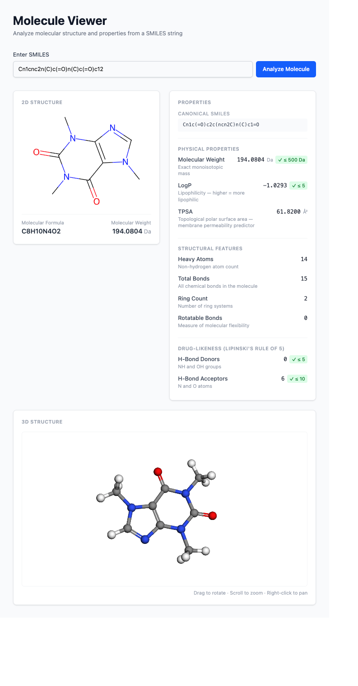

## Screenshot



## Project Overview

Molecule Viewer application for drug discovery. The backend uses **FastAPI** as the API layer and **RDKit** for cheminformatics (molecule loading, rendering, analysis). The app title is "Molecule Viewer" (`web/index.html`).

## Development Commands

The project uses a local Python 3.9 virtual environment at `services/engine/`.

```bash
# Run the FastAPI server (from repo root)
./services/engine/bin/uvicorn services.main:app --reload

# Install/update dependencies
./services/engine/bin/pip install -r services/requirements.txt

# Run a Python script directly
./services/engine/bin/python services/main.py
```

## Running with Docker

The app is fully containerized via `compose.yml` at the repo root. Both services (`api` and `web`) are defined there.

```bash
# Build and start all services
docker compose up --build

# Run in detached mode
docker compose up --build -d

# Stop all services
docker compose down
```

Once running:
- API: http://localhost:8000
- Web: http://localhost:3000

Ports can be overridden with env vars `API_PORT` and `WEB_PORT`. The frontend build receives the API URL via `VITE_API_URL` (defaults to `http://localhost:8000`).

## Architecture

```
MoleculeViewer/
├── services/
│   ├── main.py          # FastAPI application entrypoint
│   ├── requirements.txt # Python dependencies
│   └── engine/          # Python 3.9 virtual environment
└── web/                 # SolidJS frontend
```

**Key libraries:**
- `rdkit` — molecule parsing (SMILES strings via `Chem`), SVG rendering via `rdMolDraw2D`
- `fastapi` + `uvicorn` — HTTP API server
- `pydantic` — request/response validation
- `Pillow` / `numpy` — image processing support

## Frontend (web/)

SolidJS + TypeScript + Vite, with **Kobalte** (`@kobalte/core`) as the headless UI component library and **Tailwind CSS v4** for styling. Use yarn for all package management.

```bash
# From web/ directory
yarn dev        # dev server
yarn build      # production build
yarn preview    # preview build
```

**Key patterns:**
- Use `cn()` from `src/lib/utils.ts` to merge Tailwind classes (wraps `clsx` + `tailwind-merge`)
- Kobalte components are imported from `@kobalte/core/<component>` (e.g. `@kobalte/core/button`)